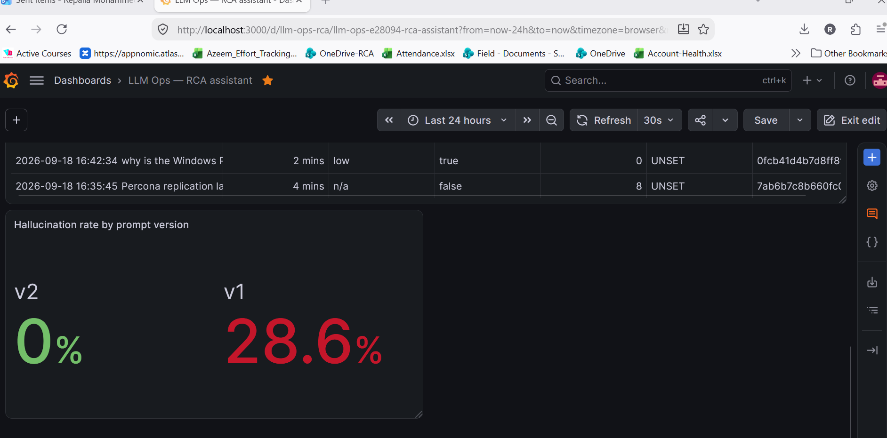

# llm-ops-lab — on-prem RAG assistant for AIOps root-cause analysis

A hands-on LLMOps lab built by an SRE: a fully offline assistant that reads infrastructure alerts and
operations runbooks and returns a **cited, schema-checked root-cause analysis** — the kind of thing a bank can
run inside its own data centre with no data leaving the building.

Runs on a laptop CPU (no GPU) with open-weight models via [Ollama](https://ollama.com).

## What it does

```
question ─► nomic-embed-text ─► vector search over runbook chunks ─► top-3 chunks ─┐
question ─► OpenSearch query over alerts   ─► matching alerts ────────────────────┼─► qwen2.5:7b ─► strict JSON
                                                                                  ┘   {root_cause, evidence,
                                                                                       next_steps, citations,
                                                                                       confidence}
```

Example (CPU, ~3 min):

```
>>> why is api-service restarting on host-03?
[retrieval] ['nomad_consul_runbook.md', 'percona_redis_runbook.md', 'haproxy_runbook.md']   [alerts matched] 8
ROOT CAUSE  : Nomad allocation restarting on host-03 due to NFS mount and Redis connection errors
CONFIDENCE  : medium
EVIDENCE    : - NFS mount unreachable on host-03 (nfs_rpc_timeouts=6, threshold 1)
              - CRITICAL Redis connection refused on host-03 (conn_errors_5m=23, threshold 5)
NEXT STEPS  : 1. docker ps | grep redis ...  2. redis-cli -h host-03 -p 6379 cluster info ...  3. nomad alloc restart <alloc>
CITATIONS   : ['percona_redis_runbook.md', 'nomad_consul_runbook.md']
```

Out-of-scope questions ("why is the Windows Power BI server slow?") return `confidence: low` and
`Insufficient evidence` instead of an invented cause.

## Layout

| Path | Purpose |
|---|---|
| `project1-rca-assistant/rca_assistant.py` | The assistant: index build, retrieval, alert matching, prompt, JSON parsing |
| `sample_corpus/` | Generic runbooks (HAProxy, OpenSearch, Nomad/Consul, Percona/Redis, TLS/Keycloak/OTel) written for this lab |
| `data/alerts.json` | 300 synthetic alerts across 8 hosts / 15 services (`tools/gen_alerts.py`), loaded into OpenSearch by `tools/load_alerts.py` |
| `project1-rca-assistant/guardrails.py` | Secret-request block, PII/IP redaction, retrieval-similarity threshold, pydantic output contract |
| `project1-rca-assistant/tracing.py` | OpenTelemetry setup (GenAI semantic conventions); JSONL / console / OTLP exporters |
| `service/app.py` | FastAPI service: `POST /rca`, `GET /health` (503 when a dependency is down), `GET /metrics` (Prometheus text), `/docs` |
| `mcp_server/tools.py` | MCP tool server (stdio): `get_alerts`, `search_runbooks`, `run_rca` (read) and `draft_ticket` (write) |
| `agent/triage.py` | Triage agent: local model + MCP tools, tool allowlist, call budget, **human approval for writes**, `--dry-run` |
| `evals/` | Golden set, eval runner (deterministic checks + LLM judge, versioned prompt/judge), latest summary |
| `grafana/` | Dashboard JSON (traces + evals) and screenshots |
| `tools/` | Loaders for OpenSearch (`load_traces.py`, `load_evals.py`, `load_alerts.py`), `gen_alerts.py`, `check_retrieval.py`, `redact_corpus.py` (pseudonymises a private runbook set so real docs can be used locally without ever being committed) |

The private corpus used for real testing is **not** in this repository; `RCA_CORPUS=<path>` points the assistant at it.

## Run it

```bash
ollama pull qwen2.5:7b && ollama pull nomic-embed-text
pip install llama-index-core llama-index-llms-ollama llama-index-embeddings-ollama
python tools/gen_alerts.py
python project1-rca-assistant/rca_assistant.py            # interactive; first run builds the index
python project1-rca-assistant/rca_assistant.py "OpenSearch cluster is RED on host-07, what do I check first?"
```

With OpenSearch running (alerts + k-NN runbook index, see `tools/`), the same code runs as a service and as an agent:

```bash
uvicorn service.app:app --host 127.0.0.1 --port 8080        # POST /rca, GET /health, GET /metrics, /docs
python agent/triage.py --dry-run "CRITICAL: HAProxy backend DOWN on host-01 (haproxy): backends_down=2"
python agent/triage.py "CRITICAL: HAProxy backend DOWN on host-01 (haproxy): backends_down=2"   # asks approve? [y/N] before writing
```

## Measured, not claimed



Every question is an OpenTelemetry trace (GenAI semantic conventions) → OpenSearch → Grafana. An eval harness
(`evals/run_evals.py`) grades a golden set with deterministic checks + an LLM judge and stores results in SQLite and
OpenSearch. Prompt v1 measured **28.6 %** hallucination; v2 (Ollama `json_mode`, stricter root-cause rules, fairer judge
rubric) measured **0 %** on the disputed questions. Both prompt and judge are versioned so the two effects can be separated.

## Findings from the first eval pass

- The model was faithful to the runbooks; one *runbook* was stale (systemd commands for a containerised service) and
  the assistant reproduced it confidently. **RAG quality is corpus quality** — the fix was the document, not the prompt.
- Vector search always returns the nearest chunks even when nothing is relevant; the model refused correctly, but a
  similarity-score threshold belongs in front of the prompt (Project 2).
- Simple keyword alert matching is brittle (`host01` vs `host-01`); Project 3 replaced it with an OpenSearch query (host/service terms + fuzzy text).

## Agentic triage with a human in the loop

```
alert ─► agent (qwen2.5:7b, tool calling) ─► get_alerts ─► run_rca (service: guardrails + trace) ─► draft_ticket?
                                                                                                   │
                                                                              >>> approve? [y/N] ◄─┘   nothing is written without a "y"
```

A real run (CPU, ~9 min): `get_alerts` → `run_rca` (200 s, cited root cause, confidence medium) → `draft_ticket` paused for approval →
ticket stored in OpenSearch with the `trace_id` of the RCA that produced it. Rails: tool allowlist, 8-call budget, write tools need
approval, `--dry-run` auto-denies, every tool call is a span (`tool.name`, `tool.args`, `tool.approved`, duration — including the
seconds the human spent reading before approving).

Three bugs the first real run exposed, all fixed in the runtime rather than the prompt:

1. **Tool contracts are read by the model.** It passed `window="1h"`; OpenSearch wanted `now-1h`. The docstring never said the
   format, so the model guessed. The tool now normalises and states the format.
2. **A fallback that lied.** The service started before OpenSearch and silently used the local index while still reporting
   `vector_store=opensearch` — so score normalisation was applied twice and every question was refused as "low similarity".
   The fallback now flips the flag that tracing, `/health` and normalisation all read.
3. **Narrated tool calls.** After ~2 k tokens of context the 7B model wrote `draft_ticket({...})` as prose, made no tool call,
   and announced "Ticket created". The agent now detects a tool name in the final text with no real call and pushes back once;
   the runtime trusts tool results, never the model's claims.

## Roadmap

- ~~**Project 2** — observability, evals, guardrails~~ ✔
- ~~**Project 3** — service + OpenSearch k-NN + MCP tool server + triage agent with human approval~~ ✔
- **Project 4** — the whole stack on Kubernetes (k3s + Helm): Ollama, service, OpenSearch, Grafana; systemd/HPA/NetworkPolicy.
